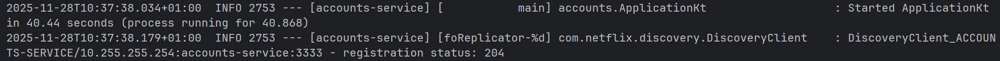
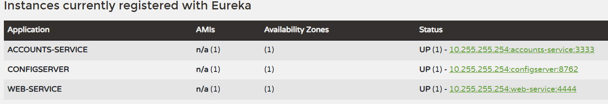
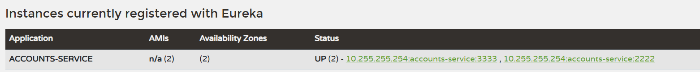
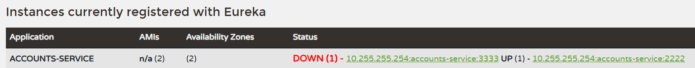
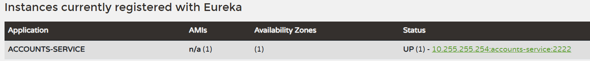
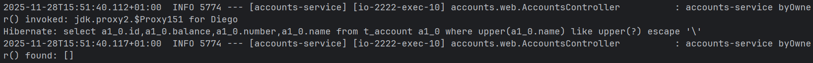

# Lab 6 Microservices - Project Report

## 1. Configuration Setup

**Configuration Repository**: [https://github.com/Simon30804/lab6-microservices.git]

Describe the changes you made to the configuration:

- What did you modify in `accounts-service.yml`?
- El valor del puerto ha sido modificado de 3333 a 2222.
- Why is externalized configuration useful in microservices?
- La configuración externalizada permite modificar el comportamiento de la aplicación en 
    diferentes entornos sin necesidad de reconstruir y volver a desplegar el código.
- Además facilita la gestión de múltiples servicios y sus configuraciones específicas.

---

## 2. Service Registration (Task 1)

### Accounts Service Registration

Explain what happens during service registration.
Cuando un microservicio se inicia, contacta al servidor Eureka en la dirección especificada en su configuración.
El servicio envía su información (nombre, dirección, puerto, etc.) al servidor Eureka para registrarse.
Eureka recibe esta información y añade la instancia a su registro de servicios disponibles, marcándola como UP.

### Web Service Registration

Explain how the web service discovers the accounts service.
El servicio web también se registra en Eureka de manera similar al servicio de cuentas.
Cuando el servicio web necesita comunicarse con el servicio de cuentas, consulta a Eureka para obtener la lista de instancias disponibles del servicio de cuentas.
Eureka responde con la información necesaria para que el servicio web pueda conectarse al servicio de cuentas.

---

## 3. Eureka Dashboard (Task 2)

Describe what the Eureka dashboard shows:
- El dashboard de eureka muestra una lista de todos los servicios registrados y sus instancias,
- Which services are registered?
- En este caso se pueden ver tanto el servicio de cuentas (ACCOUNTS-SERVICE) como el servicio web (WEB-SERVICE).
- What information does Eureka track for each instance?
- Eureka rastrea información como el estado de la instancia (UP, DOWN), la dirección IP, el puerto, la URL y otros metadatos relevantes.

---

## 4. Multiple Instances (Task 4)

Answer the following questions:

- What happens when you start a second instance of the accounts service?
- La segunda instancia se registra en Eureka con el mismo nombre de servicio pero con un ID de instancia diferente, basado en su
- puerto e IP únicos. Eureka ahora tiene dos instancias del servicio de cuentas disponibles para el balanceo de carga.
- How does Eureka handle multiple instances?
- Eureka agrupa todas las instancias  que pertenecen al mismo servicio bajo un solo nombre de servicio, permitiendo a los clientes descubrir y utilizar cualquiera de las instancias disponibles.
- How does client-side load balancing work with multiple instances?
- El cliente (en este caso, el servicio web) consulta a Eureka para obtener la lista de instancias disponibles del servicio de cuentas.
- Luego, utiliza un algoritmo de balanceo de carga (como round-robin) para distribuir las solicitudes entre las diferentes instancias, mejorando la disponibilidad y la tolerancia a fallos.

---

## 5. Service Failure Analysis (Task 5)

### Initial Failure

Describe what happens immediately after stopping the accounts service on port 3333.
- Justo después de detener la instancia del servicio de cuentas en el puerto 3333, el servicio web intenta realizar una solicitud a esa instancia, sin embargo
  dado que su caché local del registro de servicios aún no se ha actualizado, intenta conectarse a la instancia que ya no está disponible, resultando en un error de conexión.

### Eureka Instance Removal

Explain how Eureka detects and removes the failed instance:

- How long did it take for Eureka to remove the dead instance?
- La configuración en discovery/src/main/resources/application.yml (lease-expiration-duration-in-seconds: 10) indica que el servidor esperará 10 segundos sin recibir un "latido" (heartbeat) antes de considerar que la instancia ha expirado y marcarla como DOWN. El proceso de limpieza (eviction-interval-timer-in-ms: 1000) se ejecuta cada segundo para eliminar las instancias expiradas. Por lo que 
- en un máximo de 11 segundos (10 segundos de expiración + 1 segundo para la limpieza) la instancia caída debería ser eliminada del registro.
- What mechanism does Eureka use to detect failures?
- Eureka utiliza un mecanismo de latidos (heartbeats) donde cada instancia registrada envía periódicamente señales al servidor Eureka para indicar que está viva.
- Si el servidor Eureka no recibe un latido dentro de un período de tiempo configurado, marca la instancia como DOWN y eventualmente la elimina del registro.
---

## 6. Service Recovery Analysis (Task 6)

Answer the following questions:

- Why does the web service eventually recover?
- El servicio web recupera su funcionalidad porque su cliente Eureka actualiza su caché local del registro de servicios periódicamente.
- Una vez que Eureka Server elimina la instancia caída del registro, el cliente del servicio web obtiene la lista actualizada de instancias disponibles y el balanceador de carga
 del lado del cliente dejará de enviar peticiones a la instancia que acaba de ser borrada y redigirá a la instancia que sigue activa.
- How long did recovery take?
- El tiempo total de recuperación es la suma del tiempo que tarda Eureka en eliminar la instancia (10-11 segundos) y el tiempo que tarda el cliente Eureka del servicio web en actualizar su caché local,
  que en este caso es cada 30 segundos. Por lo que el tiempo total de recuperación puede ser de hasta 41 segundos.
- What role does client-side caching play in the recovery process?
- El almacenamiento en caché del lado del cliente es una optimización que evita que el cliente tenga que consultar a Eureka para
 cada solicitud. Sin embargo, esto también significa que hay un cierto retraso entre el momento en que una instancia falla y cuando el cliente se da cuenta de ello. Durante este tiempo,
 el cliente puede seguir intentando conectarse a la instancia caída hasta que su caché se actualice con la información más reciente de Eureka.

---

## 7. Conclusions

Summarize what you learned about:

- Microservices architecture
- Gracias a este laboratorio he aprendido cómo los microservicios pueden comunicarse entre sí utilizando un servidor de descubrimiento de servicios como Eureka.
- Service discovery with Eureka
- He entendido cómo Eureka facilita la gestión de múltiples instancias de servicios y permite a los clientes descubrir y conectarse a estas instancias de manera eficiente.
- System resilience and self-healing
- He aprendido sobre la importancia de la resiliencia en sistemas distribuidos y cómo los mecanismos de detección de fallos y recuperación automática pueden mejorar la disponibilidad del sistema.
- Challenges you encountered and how you solved them
- Problemas de configuración inicial y demás debido al uso de Windows.

---

## 8. AI Disclosure

**Did you use AI tools?** (ChatGPT, Copilot, Claude, etc.)

- If YES: Which tools? What did they help with? What did you do yourself?
- If NO: Write "No AI tools were used."

**Important**: Explain your own understanding of microservices patterns and Eureka behavior, even if AI helped you write parts of this report.

---

## Additional Notes

Any other observations or comments about the assignment.

